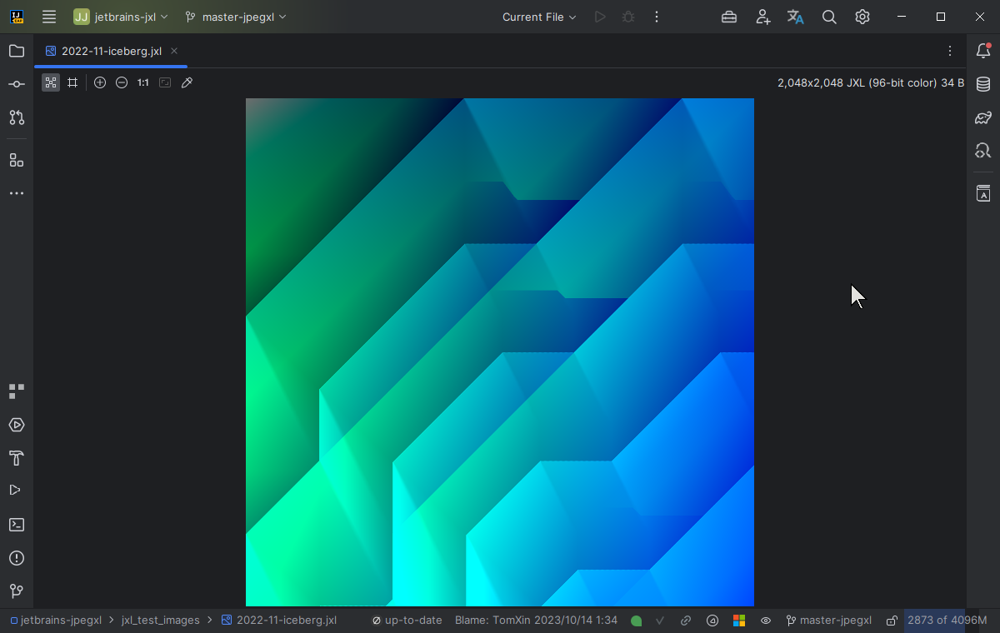

# jetbrains-jpegxl

<!-- Plugin description -->
## Introduction

Allows viewing images in the [JPEGXL](https://jpeg.org/jpegxl/) format in the Jetbrains' IDE.
Tips:Due to this problem [IDEA-332030](https://youtrack.jetbrains.com/issue/IDEA-332030/Plugin-fileType-extensions-will-disappear-after-restart-if-the-plugin-was-uninstalled-once-before), if you have uninstalled this plug-in, reinstalled this plug-in and restarted the IDE,
the function of this plug-in may be invalid. 
The solution is: find this file and remove the following entries.
`%AppData%\JetBrains\IntelliJIdea2023.3\options\filetypes.xml` -> `<removed_mapping ext="jxl" approved="true" type="Image" />`

## Power by the following projects

[jxlatte](https://github.com/Traneptora/jxlatte)  

[jetbrains-qoi](https://github.com/xiaozhuai/jetbrains-qoi)

<!-- Plugin description end -->

## Installation

- Using the IDE built-in plugin system:

  <kbd>Settings/Preferences</kbd> > <kbd>Plugins</kbd> > <kbd>Marketplace</kbd> > <kbd>Search for "texx"</kbd> >
  <kbd>Install</kbd>

- Manually:

  Download the [latest release](https://github.com/meiMingle/texx/releases/latest) and install it manually using
  <kbd>Settings/Preferences</kbd> > <kbd>Plugins</kbd> > <kbd>⚙️</kbd> > <kbd>Install plugin from disk...</kbd>

---
Plugin based on the [IntelliJ Platform Plugin Template][template].

[template]: https://github.com/JetBrains/intellij-platform-plugin-template
[docs:plugin-description]: https://plugins.jetbrains.com/docs/intellij/plugin-user-experience.html#plugin-description-and-presentation